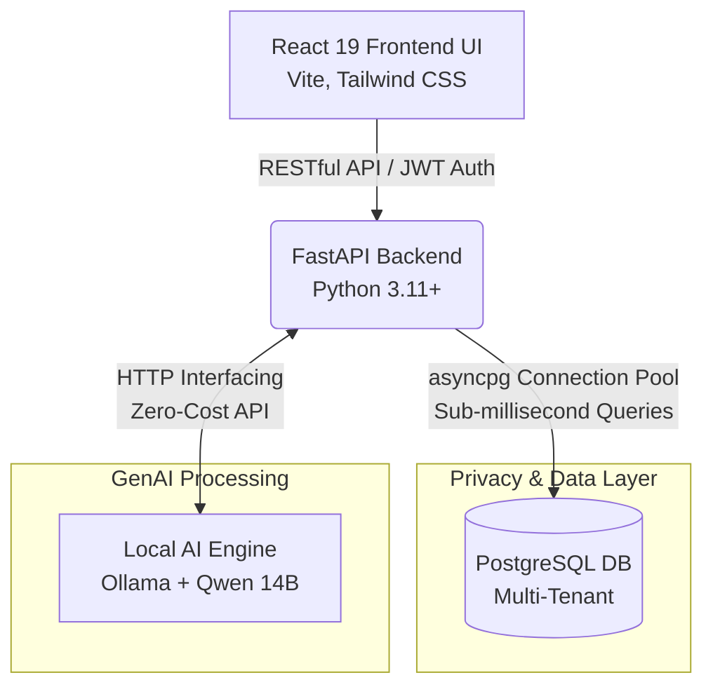
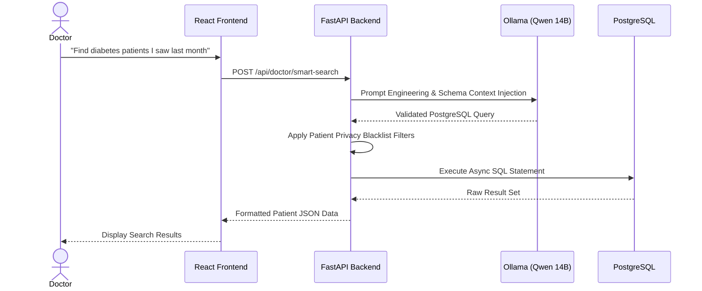
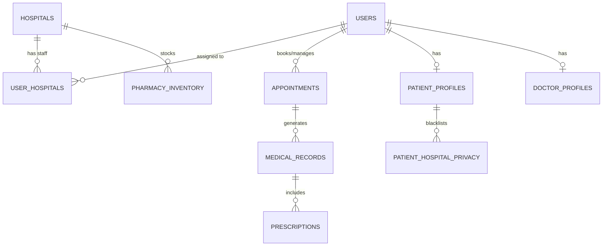

# Multi-Tenant Hospital Management System (HMS) with Local AI Integration


An enterprise-grade, high-performance **Multi-Tenant Hospital Management System (HMS)** engineered with **FastAPI (Python)**, **React 19**, and **PostgreSQL**. Designed for clinical efficiency, strict data privacy, and scalability, this platform integrates a **locally hosted Large Language Model (LLM)** to deliver secure AI features without relying on external cloud APIs. 

Ideal for demonstrating expertise in **Software Engineering (SDE)**, **Backend Architecture**, **Full-Stack Development**, and **AI Engineering / Generative AI Integration**.

---

## Table of Contents
- [Why This Tech Stack?](#-why-this-tech-stack)
- [System Architecture](#-system-architecture)
- [Key Features & AI Integration](#-key-features--ai-integration)
- [Database Schema (ERD)](#-database-schema-erd)
- [Security & RBAC](#-security--rbac)
- [Documentation & Deep Dives](#-documentation--deep-dives)
- [Quick Start](#-quick-start)

---

## Why This Tech Stack?

We specifically chose modern, asynchronous tools to handle the high concurrency requirements of a multi-tenant medical environment:

1.  **FastAPI over Django/Flask**: FastAPI provides native `async`/`await` support. In a hospital setting where multiple doctors are simultaneously generating AI prescriptions or running heavy database queries, FastAPI handles non-blocking I/O effortlessly, preventing server deadlocks.
2.  **`asyncpg` over SQLAlchemy**: ORMs like SQLAlchemy introduce abstraction overhead. By writing raw, parameterized SQL using `asyncpg`, we achieve sub-millisecond query execution times, maxing out PostgreSQL's throughput.
3.  **Local Ollama over OpenAI APIs**: Sending Protected Health Information (PHI) to third-party APIs violates strict data sovereignty rules (like HIPAA). Running Qwen 14B locally ensures 100% data retention and zero recurring API costs.
4.  **React 19 (Vite)**: Selected for its aggressive code-splitting and rapid HMR, ensuring hospital staff experience a fast, SPA feel without massive initial payload downloads.

---

## System Architecture

The application follows a decoupled, microservices-inspired architecture.



### Architectural Highlights
*   **Asynchronous Database Operations:** Bypasses traditional ORM overhead by executing raw SQL queries directly through `asyncpg` connection pools. Guarantees maximum throughput under high concurrent loads.
*   **True Multi-Tenancy:** Supports isolated data partitions across multiple hospitals (`hospitals` and `user_hospitals` schemas) sharing the same infrastructure.
*   **Granular Privacy Shielding:** Patients can toggle hospital-level blacklists, dynamically filtering their records out of search results and restricting access from specific facilities.

---

## Key Features & AI Integration (Generative AI)

To ensure clinical safety and strict data sovereignty, all Natural Language Processing (NLP) and GenAI features communicate with a local **Ollama** instance hosting the **`qwen3:14b`** model.

### AI Request Flow: NLP to SQL Engine


### AI Engineering Capabilities
1.  **Smart NLP Patient Search (Text-to-SQL):** Doctors can query patient databases using natural language. The LLM acts as an NLP-to-SQL compiler while the backend strictly enforces RBAC and privacy filters before execution.
2.  **Chronological Medical Summaries (Chain-of-Thought):** Summarizes long histories of medical records into concise clinical briefings for rapid onboarding.
3.  **AI-Generated Prescription Drafts:** Translates diagnosis and symptom lists into structured JSON (`{"medications": [], "instructions": ""}`) to save doctors administrative time. It utilizes strict prompt schemas enforced by Pydantic validation.
4.  **Pharmacy Inventory Forecasting:** Evaluates warehouse stock and recent prescriptions to predict upcoming stockouts using predictive analytics.
5.  **Context-Aware Chatbot (RAG):** Grounded with specific Retrieval-Augmented Generation (RAG) system rules regarding hospital schedules, consultation fees, and diagnostic times.

---

## Database Schema (ERD)

The database schema is heavily optimized for multi-tenant relations and secure logging.



---

## Security & RBAC

Enforces **8 distinct user roles** with rigid access control boundaries. 
*   `admin`, `hospital_admin`, `head_of_doctor`, `head_of_staff`, `doctor`, `staff`, `pharmacy`, `patient`.

### Advanced Security Mechanisms
1.  **Temporary-Token Prescription Sharing:** Patients generate a cryptographically secure token (`pharmacy_access_token`) expiring in 10 minutes for pharmacies to dispense medication without logging in.
2.  **Administrative Safe-Deletions:** Protects against malicious deletions via an `account_requests` audit queue requiring `admin` approval.
3.  **Clinical Safety Banners:** All AI-generated content triggers an `<AIBanner />` warning to ensure human-in-the-loop (HITL) verification by healthcare professionals.

---

## Documentation & Deep Dives

For an in-depth understanding of the system's core components, please explore the `docs/` folder:

*   **[System Architecture](docs/architecture.md)** - Details on microservices, backend structure, and frontend state management.
*   **[AI Features Integration](docs/ai_features.md)** - Comprehensive breakdown of prompt engineering, LLM integration, and AI safety.
*   **[Database Design](docs/database.md)** - Explanations of raw SQL implementations, schemas, and `asyncpg` optimizations.
*   **[API Reference](docs/api_reference.md)** - Key RESTful endpoints and payload structures.

---

## Quick Start

### 1. Prerequisites
*   Python 3.11+, Node.js 18+, PostgreSQL.
*   [Ollama](https://ollama.com/) (Locally installed)
*   UV Package Manager (`curl -LsSf https://astral.sh/uv/install.sh | sh`)

### 2. Configure Local AI Engine
```bash
ollama pull qwen3:14b
ollama run qwen3:14b
```

### 3. Backend Setup
```bash
cd backend
# Duplicate .env and configure DATABASE_URL
cp .env.example .env 
uv sync
uv run python -m app.init_db
uv run uvicorn app.main:app --reload
```

### 4. Frontend Setup
```bash
cd frontend
npm install
npm run dev
```

---
*Developed as a demonstration of modern full-stack capabilities, system design, and AI integration for high-stakes enterprise environments.*
