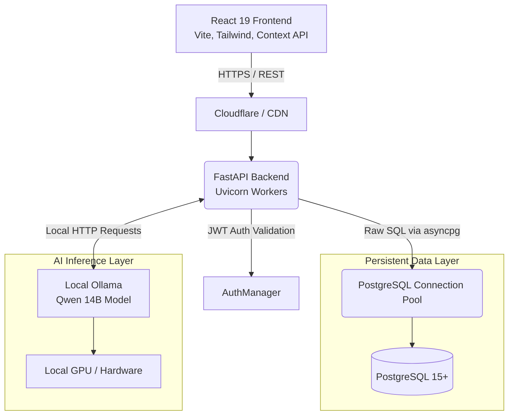
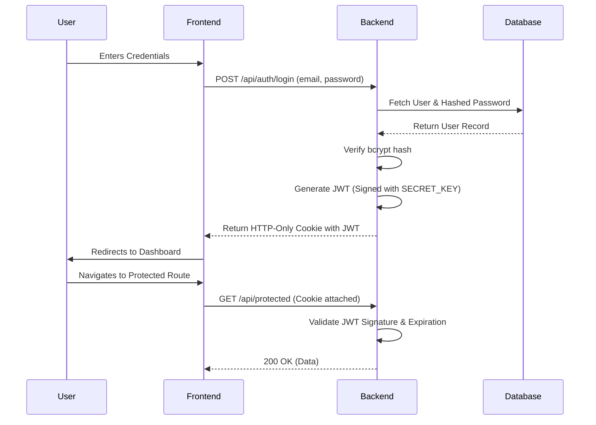

# System Architecture Deep Dive

The Hospital Management System (HMS) is engineered using a modern, decoupled architecture. By strictly separating the frontend and backend, we ensure that both systems can scale independently and leverage the best tools for their respective domains.

## High-Level Architecture Diagram

## 1. Frontend Architecture (React 19 & Vite)
The frontend is designed for high responsiveness, minimizing Time to Interactive (TTI), and providing a smooth Single Page Application (SPA) experience.

*   **Build Tool (Vite):** Selected over Webpack/Create React App for its ultra-fast Hot Module Replacement (HMR) and optimized esbuild pre-bundling.
*   **Component Structure:** Adopts a feature-based folder structure (`/features/auth`, `/features/doctor-dashboard`, etc.) rather than a type-based one (`/components`, `/hooks`). This ensures better encapsulation.
*   **State Management:** 
    *   **Context API:** Used for global, low-frequency updates like Authentication State and Theme preferences.
    *   **React Query (TanStack):** Used for server state synchronization, caching, and handling loading/error states out-of-the-box.
*   **Routing:** React Router v6 handles client-side routing with route-level code splitting (`React.lazy()`) to ensure users only download the JavaScript necessary for their current view.

## 2. Backend Architecture (FastAPI & Python 3.11+)
The backend prioritizes asynchronous execution to handle thousands of concurrent requests—a necessity for a busy multi-tenant hospital environment.

*   **FastAPI Framework:** Chosen for its native asynchronous support (`async`/`await`), automatic OpenAPI documentation generation, and incredible speed (powered by Starlette and Pydantic).
*   **Dependency Injection:** FastAPI’s dependency injection system is heavily utilized to pass database connections, verify JWT tokens, and check role-based permissions at the route level.
*   **No ORM (asyncpg):** Traditional ORMs like SQLAlchemy can introduce significant overhead and complex abstraction layers. By using `asyncpg`, we write raw parameterized SQL, achieving speeds up to 3x faster than traditional synchronous drivers like `psycopg2`.

## 3. Authentication & Security Flow
The system utilizes stateless JWT (JSON Web Tokens) to authenticate users securely without requiring server-side session storage.

## 4. Multi-Tenancy Strategy
Instead of creating a separate database for every hospital (which increases overhead and complicates migrations) or a separate schema per tenant, we utilize a **Shared Database, Shared Schema** approach with row-level tenant isolation.

*   Every relevant table includes a `hospital_id` foreign key.
*   All backend database queries are intercepted by a multi-tenant middleware/dependency that automatically appends `WHERE hospital_id = ?` to queries based on the authenticated user's assigned hospital.
*   This approach makes scaling to thousands of clinics effortless while maintaining strict data boundaries.
